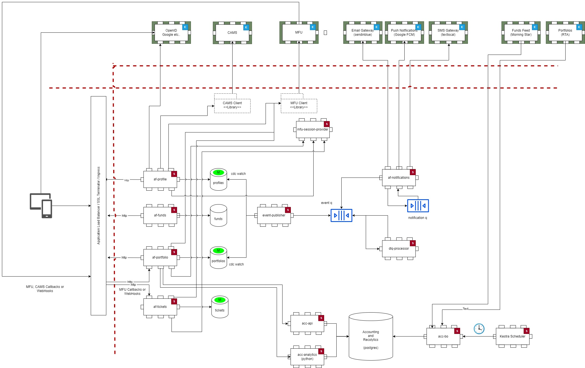

# Home

The AllFunds architecture embodies the following principles.

 - Single Responsibility Principle
 - Event Driven
 - Container first [Approach]( https://www.docker.com/blog/5-benefits-of-a-container-first-approach-to-software-development/)
 - Simple and out of the box scaling. No single point of failure.
 - Simplified and predictable deployments
 - Promote Microservice adoption
 - Utilise 12-factor principles in building the application components
 
 The below diagram shows a conceptual overview of the entire application.
 
 

