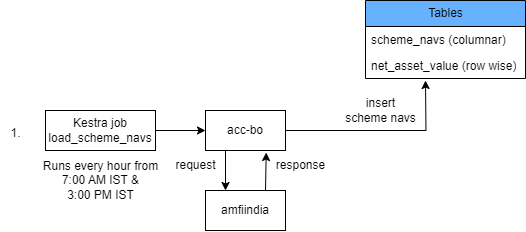
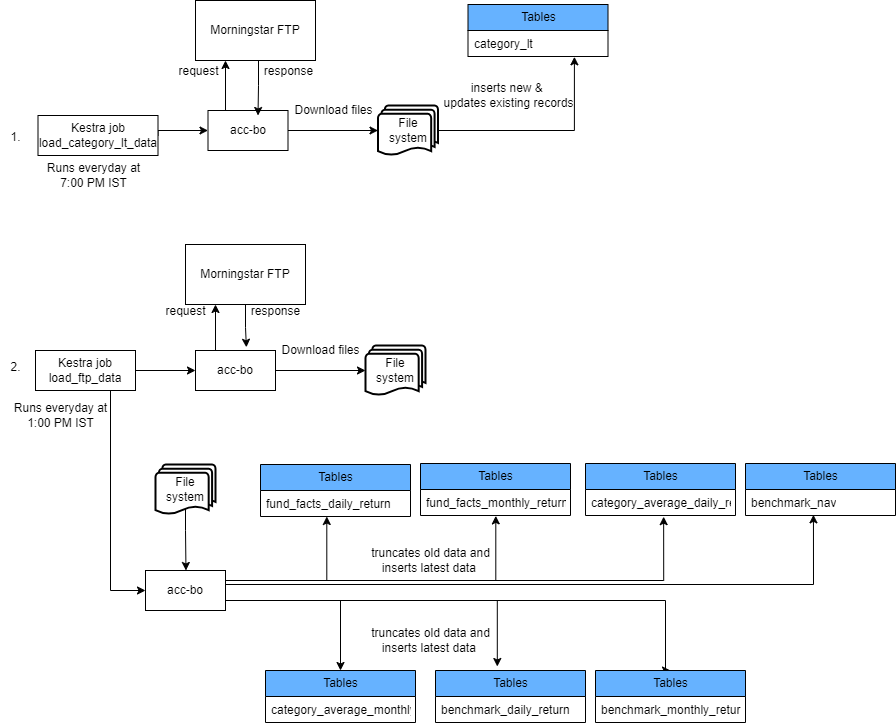
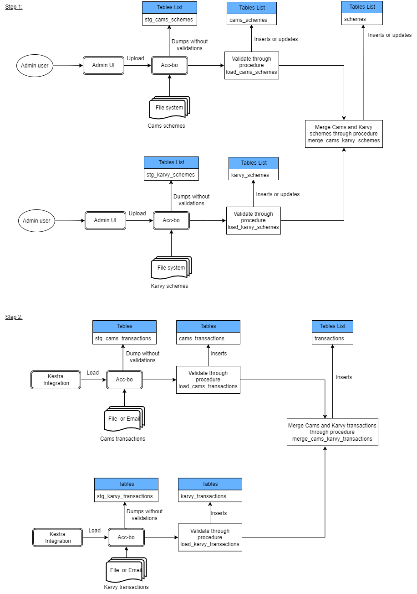
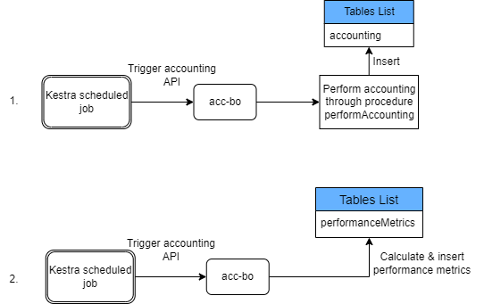
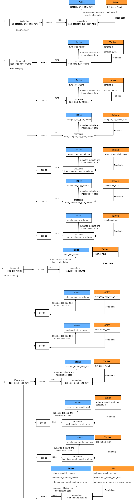
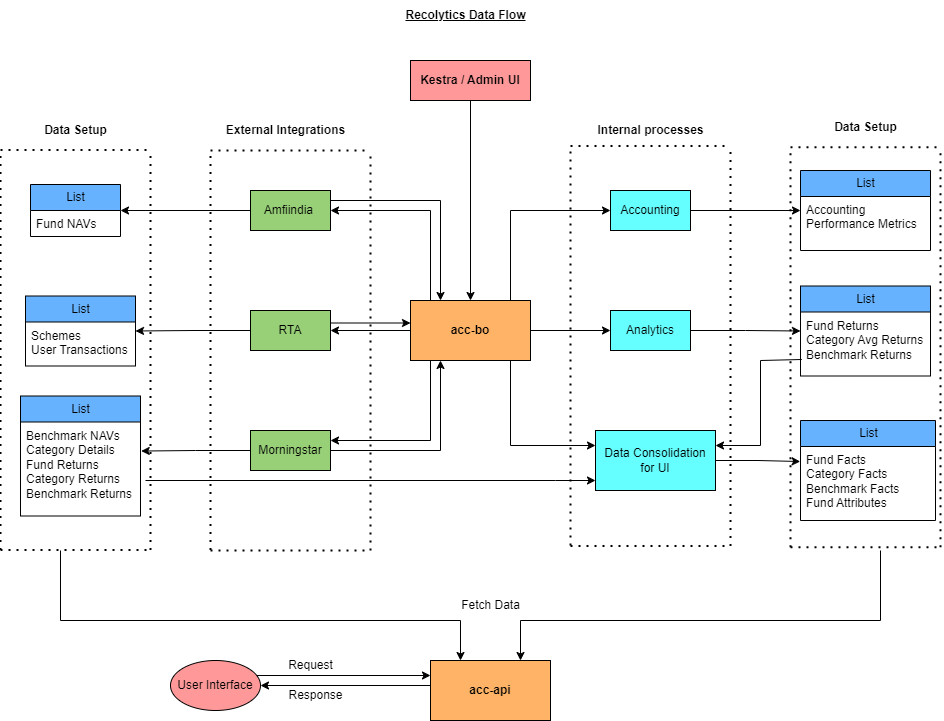

#Data Flow

####1. Data setup from Amfiindia: 
```
NAV data of the funds gets loaded from amfiindia website into below tables.
a. net_asset_value (row-wise)
b. scheme_navs (columnar)
```
[]

####2. Data setup from Morningstar
```
Below data gets loaded from Morningstar through FTP site.
a. schemes data
b. benchmark Nav data
c. Daily returns of funds, benchmarks and categories
d. Monthly returns of funds, benchmarks and categories
```



####3. Data setup from RTA source
```
Loads below data from RTA source (Cams and Karvy)
a. schemes data 
b. User Transactions data 
```


####4. Accounting data flow on RTA transactions
````
Performs accounting on top of the user transactions everyday and loads below data
a. Accounting
b. Performance Metrics 
````


####5. Internal Analytics
````
Below data is being calculated at recolytics end
a. p2p, CY and SIP returns of funds, benchmarks and categories
b. Month end Nav returns of funds, benchmarks and categories
c.Various returns of the funds, benchmarks and categories (python code)

````


####6. Data consolidation flow
````
Generates below consolidated data from the available returns data
a. fund, categorya and benchmark facts: consolidated data of all the returns
b. fund attributes: consolidated view of the fund details
````


####7. Overall Recolytics Data flow
````
This flow descibes the overall data flow in the recolytics layer
````

