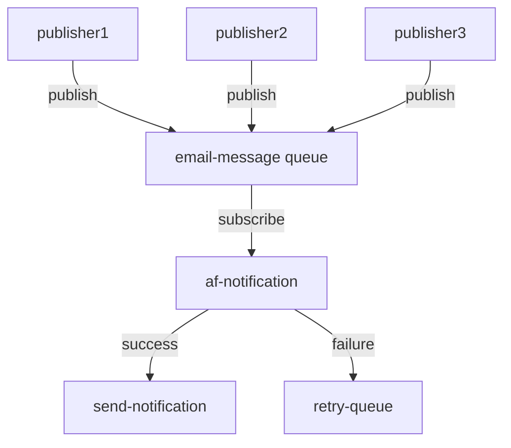

# Portfolio Microservice

<span dir="">Portfolio is a collection of a wide range of asset classes like Equity, Debt, and Gold, spread across different asset strategies like Mutual Funds, etc. 
The right portfolio depends on users’ investment style, goals, risk tolerance, and time horizon (Short term / Long term). 
A good degree of diversification is recommended regardless of the portfolio type to avoid putting all your eggs in one basket.</span>


# Interface

## Messaging

### Commands

#### SendEmailCommand

<span dir="">The SendEmailCommand payload consumed from different module via RabbitMQ message broker to notify user with email format.</span>

| Queue | Routing Key | Headers | Retriable |  |
|-------|-------------|---------|-----------|--|
| email-queue |  | content_type=application/json | Yes |  |

```json
{
  "$schema": "http://json-schema.org/draft-04/schema#",
  "type": "object",
  "properties": {
    "from": {
      "type": "string"
    },
    "to": {
      "type": "string"
    },
    "templateKey": {
      "type": "string"
    },
    "parameters": {
      "type": "object",
      "properties": {
        "orderNo": {
          "type": "string"
        },
        "address": {
          "type": "string"
        },
        "bodyParam": {
          "type": "string"
        }
      },
      "required": [
        "orderNo",
        "address",
        "bodyParam"
      ]
    }
  },
  "required": [
    "from",
    "to",
    "templateKey",
    "parameters"
  ]
}
```

### Events

#### ExampleEvent

| Exchange | Routing Key | Headers |  |
|----------|-------------|---------|--|
| email-exchange |  |content_type=application/json  |  |

```json
json schema of the payload
```

### Bindings

| Exchange | Type | Queue | Routing Key |
|----------|------|-------|-------------|
| email-exchange |topic  | email-queue |  |


# Diagrams

Data flow diagram

## Example diagram




# Persistence

## Postgres

| Aspect | Value |
|--------|-------|
| Database Engine | postgresql |
| Schema |  |
| Migrations | Yes / No |
| Charset | UTF-8 |

### Dictionary

#### Tables

| Table | Purpose |
|-------|---------|
| templates | Maintain all templates |
| notifications_audit| Maintain notification data |

#### Fields

| Table | Field | Purpose | Type | Size | Nullable | Keys |
|-------|-------|---------|------|------|----------|------|
| notifications_audit| id | Identifier | int |  | No | PK |
| notifications_audit| sender| notification sender | text| 255 | Yes |  |
| notifications_audit| receiver| notification receiver| text| 255 | Yes |  |
| notifications_audit| message| message | text| 255 | Yes | |
| notifications_audit| createdDate| notification created date | date| 20 | Yes |  |

| Table | Field | Purpose | Type | Size | Nullable | Keys |
|-------|-------|---------|------|------|----------|------|
| templates| key| Identifier | text|  | No | PK |
| templates| description| template description | text| 255 | Yes |  |
| templates| type| notification type | text| 255 | Yes |  |
| templates| subject| email subject | text| 255 | Yes |  |
| templates| body| email body | text| 255 | Yes |  |
| templates| status| template status | text| 1| Yes |  |

## Mongo

### Collections

#### Example

```json

```

# Build

| Aspect | Value |
|--------|-------|
| Artifacts |  |
| Location |  |

# Deployment

# Security

# Scalability

# Resilience