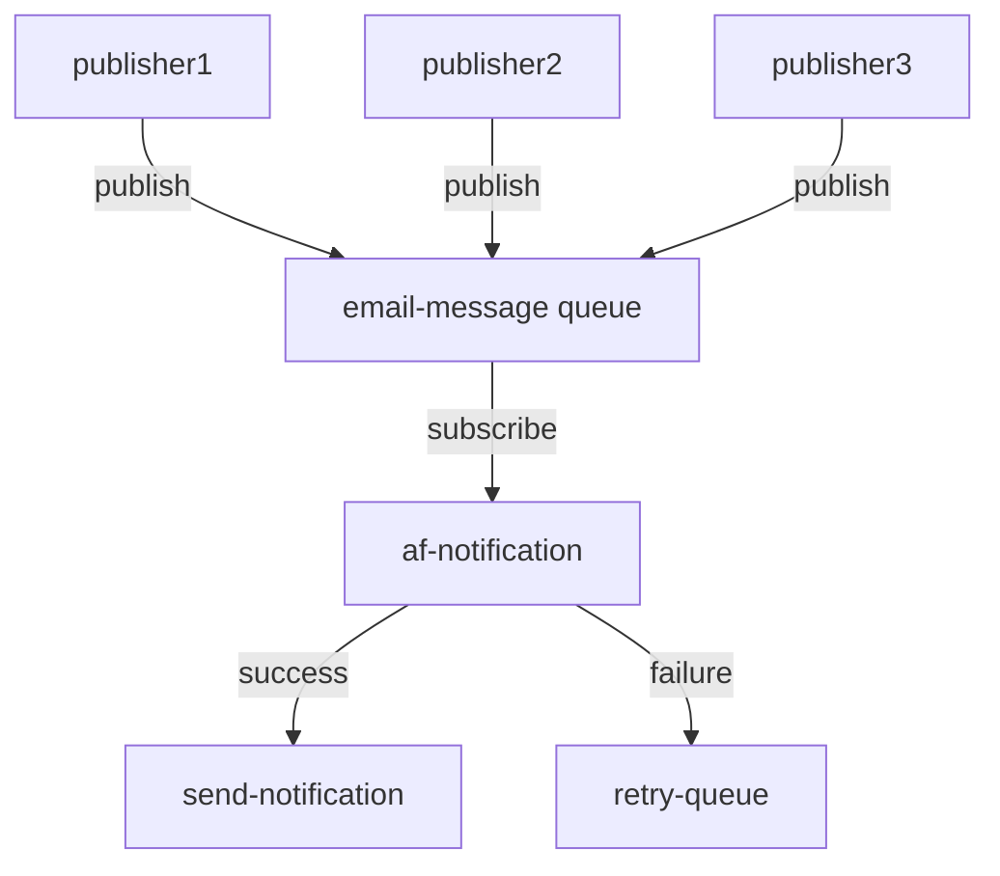

# Profile Microservice

<span dir="">User profile data, including financial goals, risk tolerance, and investment preferences, forms the core of effective wealth management, ensuring personalized strategies that align with clients' unique objectives.</span>

# Interface

## Messaging

### Commands

#### SendEmailCommand

<span dir="">The SendEmailCommand payload consumed from different module via RabbitMQ message broker to notify user with email format.</span>

| Queue | Routing Key | Headers | Retriable |  |
|-------|-------------|---------|-----------|--|
| email-queue |  | content_type=application/json | Yes |  |

```json
{
  "$schema": "http://json-schema.org/draft-04/schema#",
  "type": "object",
  "properties": {
    "from": {
      "type": "string"
    },
    "to": {
      "type": "string"
    },
    "templateKey": {
      "type": "string"
    },
    "parameters": {
      "type": "object",
      "properties": {
        "orderNo": {
          "type": "string"
        },
        "address": {
          "type": "string"
        },
        "bodyParam": {
          "type": "string"
        }
      },
      "required": [
        "orderNo",
        "address",
        "bodyParam"
      ]
    }
  },
  "required": [
    "from",
    "to",
    "templateKey",
    "parameters"
  ]
}
```

### Events

#### ExampleEvent

| Exchange | Routing Key | Headers |  |
|----------|-------------|---------|--|
| email-exchange |  | content_type=application/json |  |

```json
json schema of the payload
```

### Bindings

| Exchange | Type | Queue | Routing Key |
|----------|------|-------|-------------|
| email-exchange | topic | email-queue |  |

# Diagrams

Data flow diagram

## Example diagram



# Persistence

## Mongo

| Aspect | Value |
|--------|-------|
| Database Engine | mongo |
| Schema | profile-db |
| Migrations | Yes / No |
| Charset | UTF-8 |

### Dictionary

#### Collections

| Collections | Purpose |
|-------------|---------|
| verification | Otps sent for Mobile and email verification stored |
| users | user data is stored |
| sfa_token | to save long living tokens |

#### Json Schema
user
```json
{
  "$schema": "http://json-schema.org/draft-04/schema#",
  "type": "object",
  "properties": {
    "code": {
      "type": "string"
    },
    "data": {
      "type": "object",
      "properties": {
        "userDetails": {
          "type": "object",
          "properties": {
            "_id": {
              "type": "string"
            },
            "userId": {
              "type": "string"
            },
            "iamId": {
              "type": "string"
            },
            "schemaver": {
              "type": "integer"
            },
            "traits": {
              "type": "object",
              "properties": {
                "email": {
                  "type": "string"
                },
                "phoneNumber": {
                  "type": "string"
                },
                "firstName": {
                  "type": "string"
                },
                "lastName": {
                  "type": "string"
                },
                "isEmailVerified": {
                  "type": "boolean"
                },
                "isMobileVerified": {
                  "type": "boolean"
                }
              },
              "required": [
                "email",
                "phoneNumber",
                "firstName",
                "lastName",
                "isEmailVerified",
                "isMobileVerified"
              ]
            },
            "address": {
              "type": "object",
              "properties": {
                "address": {
                  "type": "string"
                },
                "city": {
                  "type": "string"
                },
                "pinCode": {
                  "type": "string"
                },
                "state": {
                  "type": "string"
                },
                "country": {
                  "type": "string"
                }
              },
              "required": [
                "address",
                "city",
                "pinCode",
                "state",
                "country"
              ]
            },
            "pan": {
              "type": "string"
            },
            "can": {
              "type": "string"
            },
            "membershipPlan": {
              "type": "string"
            },
            "UCC": {
              "type": "string"
            }
          },
          "required": [
            "_id",
            "userId",
            "iamId",
            "schemaver",
            "traits",
            "address",
            "pan",
            "can",
            "membershipPlan",
            "UCC"
          ]
        }
      },
      "required": [
        "userDetails"
      ]
    }
  },
  "required": [
    "code",
    "data"
  ]
}
```
## Mongo

### Collections

Here we are using some collections like

```
verification - used to store the otps for the email and phone verifications.
```

users - used to save the users data

sfa_token - used to save the long lived sfa tokens

#### Example

```json
```

# Build

| Aspect | Value |
|--------|-------|
| Artifacts |  |
| Location |  |

# Deployment

# Security

# Scalability

# Resilience