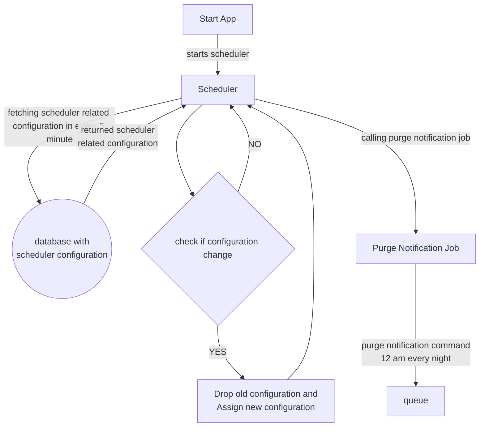

> This component is deprecated and is replaced by Kestra. It is documented here only for historical purposes.

# Scheduler Microservice

af-scheduler: af-scheduler component is scheduler service of all-funds. This component manages jobs as scheduled tasks. Tasks related configurations are stored in database table. Jobs are triggered in regular interval of time as defined by cron expression. Once scheduler service starts, it fetches job related configuration from database and schedules the jobs with fetched configuration. It fetches configuration in every 5 minutes and checks if any configuration change happens. Old configuration of jobs will be deleted, and new configuration will be added to scheduler once change detected in configuration.\
\
Jobs: 1-Purge notification: Purge notification Job is triggered every midnight 12 am. Purge notification command is published to Rabbit MQ. From there, Notification service will consume the command and start deleting older notifications.

# Interface

## Messaging

### Commands

#### ExecuteJobCommand

<span dir="">The ExecuteJobCommand payload consumed from af-notification module via RabbitMQ message broker to notify notification component to purge older notifications.</span>

| Queue | Routing Key | Headers | Retriable |  |
|-------|-------------|---------|-----------|--|
| purge-notification |  | content_type=application/json | Yes |  |

```json
{
  "$schema": "http://json-schema.org/draft-04/schema#",
  "type": "object",
  "properties": {
    "from": {
      "type": "string"
    },
    "to": {
      "type": "string"
    },
    "templateKey": {
      "type": "string"
    },
    "parameters": {
      "type": "object",
      "properties": {
        "orderNo": {
          "type": "string"
        },
        "address": {
          "type": "string"
        },
        "bodyParam": {
          "type": "string"
        }
      },
      "required": [
        "orderNo",
        "address",
        "bodyParam"
      ]
    }
  },
  "required": [
    "from",
    "to",
    "templateKey",
    "parameters"
  ]
}
```

### Events

#### ExampleEvent

| Exchange | Routing Key | Headers |  |
|----------|-------------|---------|--|
| purge-notification |  | content_type=application/json |  |

```json
json schema of the payload
```

### Bindings

| Exchange | Type | Queue | Routing Key |
|----------|------|-------|-------------|
| purge-notification | topic | email-queue |  |

# Diagrams

Data flow diagram

## Example diagram



# Persistence

## Postgres

| Aspect | Value |
|--------|-------|
| Database Engine | postgresql |
| Schema |  |
| Migrations | Yes / No |
| Charset | UTF-8 |

### Dictionary

#### Tables

| Table | Purpose |
|-------|---------|
| schedule | Maintain all configuration related to scheduler |

#### Fields

| Table | Field | Purpose | Type | Size | Nullable | Keys |
|-------|-------|---------|------|------|----------|------|
| schedule | job_key | Identifier | int |  | No | PK |
| schedule | job_description | notification sender | text | 255 | Yes |  |
| schedule | schedule_cron | notification receiver | text | 255 | Yes |  |
| schedule | routing_key | message | text | 255 | Yes |  |
| schedule | context | notification created date | date | 20 | Yes |  |
| schedule | active  | 
| schedule | payload |
| schedule | created |
| schedule | last_modified |


## Mongo

### Collections

#### Example

```json
```

# Build

| Aspect | Value |
|--------|-------|
| Artifacts |  |
| Location |  |

# Deployment

# Security

# Scalability

# Resilience