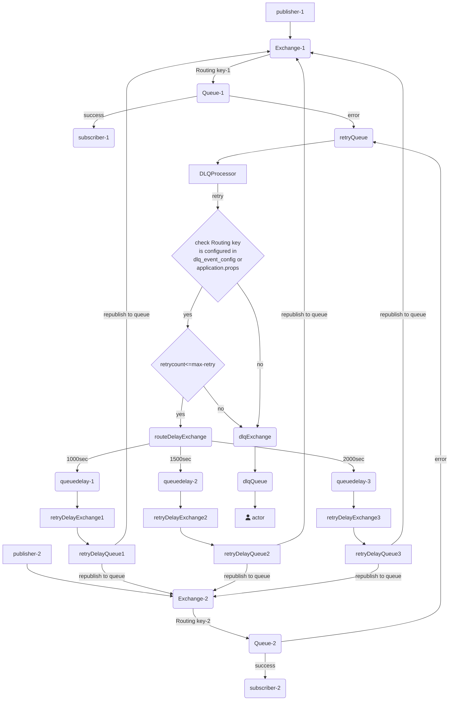

# DLQ Processor

An af-dlq-processor component will consume all undelivered or exception messages from the retry queue, then it will check that the routing key is configured in the dlq_event_config table and application.properties. If it is configured, then it will start the retry processing based on max retries in the dlq_event_config table otherwise it will publish the message to dead letter queue.

**Retry Processing**

In the retry processing it will publish the message to route exchange by using delay routing key (i.e here we are creating delay routing key by using routing key plus retry count).The delay routing keys will be binded with delay queues , these delay queues will consume the message and hold the message with configured TTL (time to leave).Once the message elapsed TTL time that message automatically moved to configured retry queues. The retry queues will consume the message and publish to origin queue for reprocessing. This process will be repeated until it reaches to max retries, once it reached to max retries still the issue presist, then that message will be moved to dead letter queue.

# Interface

## Messaging

### Exchanges

#### Retry Exchanges

| Exchange | Routing Key | Headers |  |
|----------|-------------|---------|--|
| retry-exchange | retry-routing-key | content_type=application/json |  |
| retry-exchange-1 | retry.#.1 | content_type=application/json |  |
| retry-exchange-2 | retry.#.2 | content_type=application/json |  |
| retry-exchange-3 | retry.#.3 | content_type=application/json |  |

#### Route Delay Exchanges

This Exchanges is used to publish the message to retry delay queues based on routing key

| Exchange | Routing Key | Headers |  |
|----------|-------------|---------|--|
| route-delay | binding.#.1 | content_type=application/json |  |
| route-delay | binding.#.2 | content_type=application/json |  |
| route-delay | binding.#.3 | content_type=application/json |  |

#### Dead Letter Exchanges

This Exchanges is used to publish the message based on routing key

| Exchange | Routing Key | Headers |  |
|----------|-------------|---------|--|
| dlq-exchange | dlq-routing-key | content_type=application/json |  |

#### Test Exchanges

This Exchanges is used to publish the test messages based on routing key

| Exchange | Routing Key | Headers |  |
|----------|-------------|---------|--|
| test-retry-exchange | rk.test.pass | content_type=application/json |  |
| test-retry-exchange | rk.test.fail | content_type=application/json |  |
| test-retry-exchange | rk.test.fail.pass | content_type=application/json |  |

### Queues

#### Retry Queues

This Queue will consume any undelivered or exception messages from the retry queue and send them to the retry delay queue.

| Queue | Routing Key | Headers | Retriable | Arguments |
|-------|-------------|---------|-----------|-----------|
| retry-queue | retry-routing-key | content_type=application/json |  |  |
| retry-queue-1 | retry.#.1 | content_type=application/json |  |  |
| retry-queue-2 | retry.#.2 | content_type=application/json |  |  |
| retry-queue-3 | retry.#.3 | content_type=application/json |  |  |

#### Delay Queues

This Queues will hold message based on TTL time and send them to the Origin queue.

| Queue | Routing Key | Headers | Retriable | Arguments |
|-------|-------------|---------|-----------|-----------|
| queue.delay.1 | binding.#.1 | content_type=application/json |  | x-dead-letter-exchange:retry-exchange-1,x-dead-letter-routing-key:retry.#.1,x-message-ttl:10000 |
| queue.delay.2 | binding.#.2 | content_type=application/json |  | x-dead-letter-exchange:retry-exchange-2,x-dead-letter-routing-key:retry.#.2,x-message-ttl:15000 |
| queue.delay.3 | binding.#.3 | content_type=application/json |  | x-dead-letter-exchange:retry-exchange-3,x-dead-letter-routing-key:retry.#.3,x-message-ttl:20000 |

#### Dead Queues

This Queues used to hold the dead message

| Queue | Routing Key | Headers | Retriable | Arguments |
|-------|-------------|---------|-----------|-----------|
| dlq-queue | dlq-routing-key | content_type=application/json |  |  |

#### Test Queues

This Queues is used for consuming the test messages

| Queue | Routing Key | Headers | Retriable | Arguments |
|-------|-------------|---------|-----------|-----------|
| test-pass-queue | rk.test.pass | content_type=application/json |  | x-dead-letter-exchange:retry-exchange, x-dead-letter-routing-key: retry-routing-key, durable:true |
| test-fail-queue | rk.test.fail | content_type=application/json |  | x-dead-letter-exchange:retry-exchange, x-dead-letter-routing-key: retry-routing-key , durable:true |
| test-fail-pass-queue | rk.test.fail.pass | content_type=application/json |  | x-dead-letter-exchange:retry-exchange, x-dead-letter-routing-key: retry-routing-key , durable:true |

### Bindings

#### Retry Binding

| Exchange | Type | Queue | Routing Key |
|----------|------|-------|-------------|
| retry-exchange | topic | retry-queue | retry-routing-key |
| retry-exchange-1 | topic | retry-queue-1 |  |
| retry-exchange-2 | topic | retry-queue-2 |  |
| retry-exchange-3 | topic | retry-queue-3 |  |

#### Route Delay Binding

| Exchange | Type | Queue | Routing Key |
|----------|------|-------|-------------|
| route-delay | topic | queue.delay.1 | binding.#.1 |
| route-delay | topic | queue.delay.2 | binding.#.2 |
| route-delay | topic | queue.delay.3 | binding.#.3 |

#### Dead Letter Binding

| Exchange | Type | Queue | Routing Key |
|----------|------|-------|-------------|
| dlq-exchange | topic | dlq-queue | dlq-exchange |

#### Test Retry Binding

| Exchange | Type | Queue | Routing Key |
|----------|------|-------|-------------|
| test-retry-exchange | topic | test-pass-queue | rk.test.pass |
| test-retry-exchange | topic | test-fail-queue | rk.test.fail |
| test-retry-exchange | topic | test-fail-pass-queue | rk.test.fail.pass |

# Diagrams

Data flow diagram

## Example diagram

# Persistence

## Postgres

| Aspect | Value |
|--------|-------|
| Database Engine | postgresql |
| Schema |  |
| Migrations | Yes / No |
| Charset | UTF-8 |

### Dictionary

#### Tables

| Table | Purpose |
|-------|---------|
| dlq_event_config | This table is used to configure retries |

#### Fields

| Table | Field | Purpose | Type | Size | Nullable | Keys |
|-------|-------|---------|------|------|----------|------|
| dlq_event_config | id | Identifier | int |  | No | PK |
| dlq_event_config | name | routing key name | varchar | 100 | Yes |  |
| dlq_event_config | max_retries | max retries count | integer |  | Yes |  |

# Build

| Aspect | Value |
|--------|-------|
| Artifacts |  |
| Location |  |

# Deployment

To be filled

# Security

To be filled

# Scalability

To be filled

# Resilience

To be filled