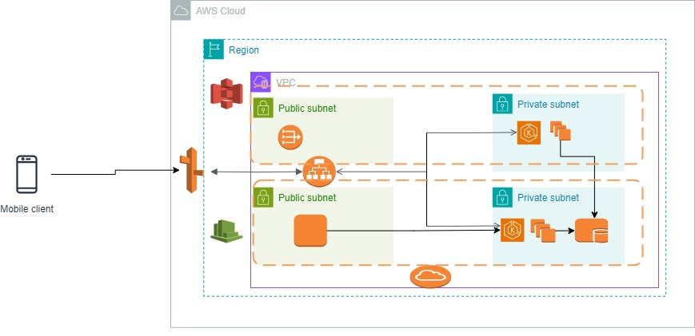

# Overview

This page presents an overview of our staging environment.

## Infrastructure

Following infrastructure is available in staging environment.

## Services Used

- VPC

- Internet GateWay

- NAT GateWay

- Elastic Kubernetes Service

- Elastic Compute cloud

- Application Load Balancer

- Simple Storage Service

- Cloud Watch

- Route53

- Secrets Manager

## Architecture Diagram

We are hosting the staging environment in Mumbai (ap-sout-1) region.

VPC CIDR Range : 10.0.0.0/16

2 Public Subnets: 

    - 10.0.1.0/24  ( Hosted in ap-south-1a Availability Zone )

    - 10.0.2.0/24  ( Hosted in ap-south-1b Availability Zone )

2 Private Subnets:

    - 10.0.3.0/24   ( Hosted in ap-south-1a Availability Zone )

    - 10.0.4.0/24   ( Hosted in ap-south-1b Availability Zone )

- An Internet Gateway is attached to VPC to enable the internet connectivity for the infrastructure hosted in 2 public subnets

- A NAT Gateway is placed in public subnet to enable the internet connectivity for the infrastructure hosted in private subnets

- An EKS Cluster is provisioned with node group ( group of EC2 Servers ) to deploy the application in containerized form.

- The Application Load balancer is in place to route the traffic to the application ( path based routing)

- Databases (Postgres, MongoDB)  and Message Broker ( RabbitMQ) are hosted as containers on a server in a private subnet.

- Application is hosted at domain ( https://staging-allfundscloud.in), a record is created with CNAME type in Route53

- For storage, Simple Storage Service buckets are being used.

- For Monitoring purpose, CloudWatch is in place.