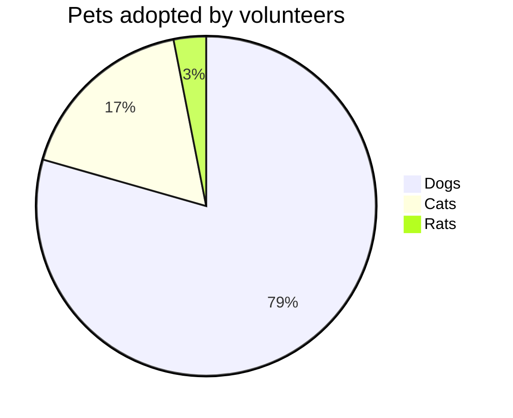
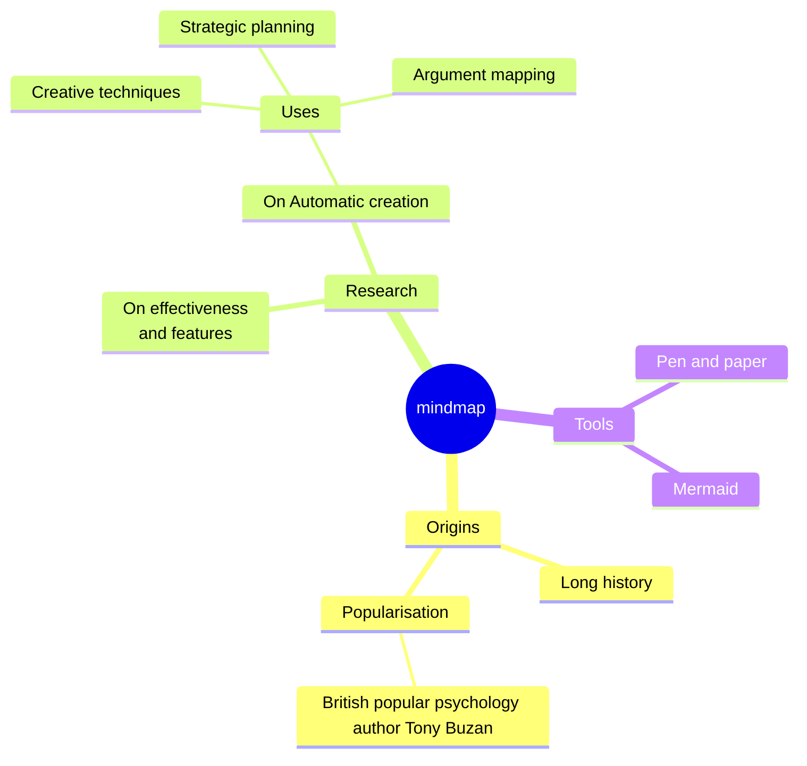
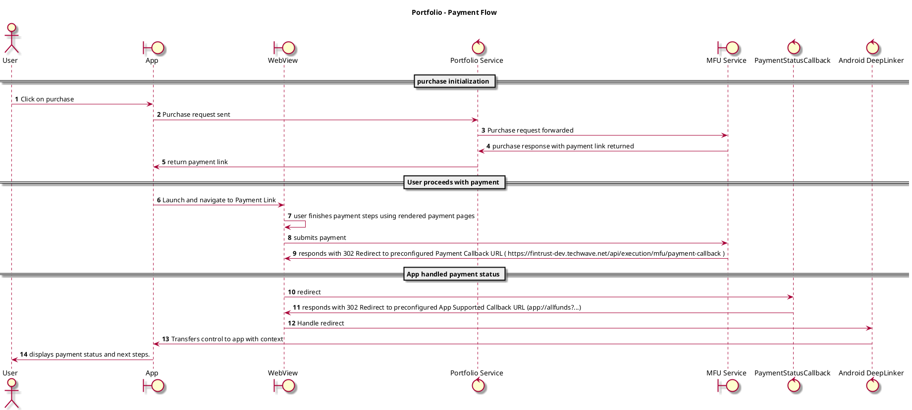

# Playground to try out various diagrams

## State Machine

```kroki-plantuml
@startuml
[*] --> Creating
Creating -> Created
Created -> Started
Started -> Stopped
Created --> [*]
Started --> [*]
Stopped --> [*]
@enduml
```
```xkroki-plantuml
@startuml
[*] --> Creating
Creating -> Created
Created -> Started
Started -> Stopped
Created --> [*]
Started --> [*]
Stopped --> [*]
@enduml
```


## Pie Chart

```xmermaid
pie title Pets adopted by volunteers
    "Dogs" : 386
    "Cats" : 85
    "Rats" : 15
```

## Mindmap

```xmermaid
mindmap
  root((mindmap))
    Origins
      Long history
      ::icon(fa fa-book)
      Popularisation
        British popular psychology author Tony Buzan
    Research
      On effectiveness<br/>and features
      On Automatic creation
        Uses
            Creative techniques
            Strategic planning
            Argument mapping
    Tools
      Pen and paper
      Mermaid
```

# Sequence Diagram



# Block Diagram
```kroki-blockdiag no-transparency=false
blockdiag {
  blockdiag -> generates -> "block-diagrams";
  blockdiag -> is -> "very easy!";
  blockdiag -> is -> "also fun too!";

  blockdiag [color = "greenyellow"];
  "block-diagrams" [color = "pink"];
  "very easy!" [color = "orange"];
}
```

```
xkroki-blockdiag no-transparency=false
blockdiag {
  blockdiag -> generates -> "block-diagrams";
  blockdiag -> is -> "very easy!";
  blockdiag -> is -> "also fun too!";

  blockdiag [color = "greenyellow"];
  "block-diagrams" [color = "pink"];
  "very easy!" [color = "orange"];
}
```